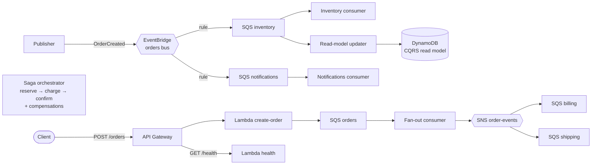

# Event-driven architecture · Labs 9–12

← [Back to the README](../../README.md)

```mermaid
flowchart LR
    PUB[Publisher] -->|OrderCreated| EB{{EventBridge<br/>orders bus}}
    EB -->|rule| QI[SQS inventory]
    EB -->|rule| QN[SQS notifications]
    QI --> CI[Inventory consumer]
    QN --> CN[Notifications consumer]
    QI --> RM[Read-model updater] --> DDB[(DynamoDB<br/>CQRS read model)]
    SAGA[Saga orchestrator<br/>reserve → charge → confirm<br/>+ compensations]

    CL([Client]) -->|POST /orders| API[API Gateway]
    API --> LC[Lambda create-order] --> QO[SQS orders]
    API -->|GET /health| LH[Lambda health]
    QO --> FAN[Fan-out consumer] --> SNS{{SNS order-events}}
    SNS --> QB[SQS billing]
    SNS --> QS[SQS shipping]
```

Labs: [9](../labs/lab-09.md) · [10](../labs/lab-10.md) · [11](../labs/lab-11.md) · [12](../labs/lab-12.md)
