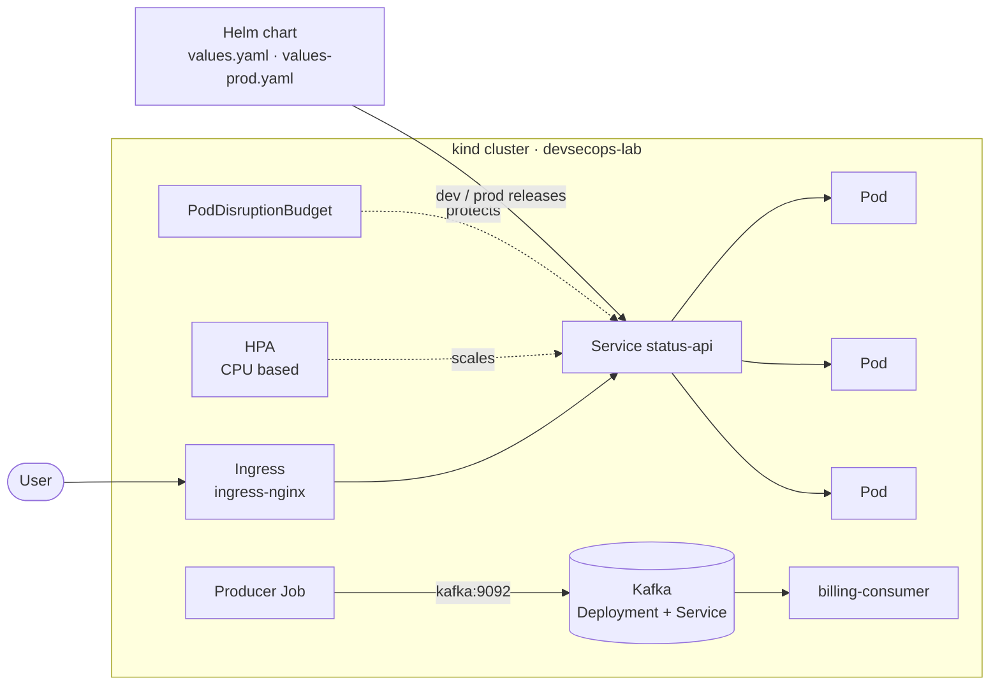

# Containers & Kubernetes · Labs 13–16

← [Back to the README](../../README.md)

```mermaid
flowchart LR
    U([User]) --> ING[Ingress<br/>ingress-nginx]
    subgraph Cluster [kind cluster · devsecops-lab]
        ING --> SVC[Service status-api]
        SVC --> P1[Pod] & P2[Pod] & P3[Pod]
        HPA[HPA<br/>CPU based] -.scales.-> SVC
        PDB[PodDisruptionBudget] -.protects.-> SVC
        PROD[Producer Job] -->|kafka:9092| K[(Kafka<br/>Deployment + Service)]
        K --> CONS[billing-consumer]
    end
    HELM[Helm chart<br/>values.yaml · values-prod.yaml] -->|dev / prod releases| SVC
```

Labs: [13](../labs/lab-13.md) · [14](../labs/lab-14.md) · [15](../labs/lab-15.md) · [16](../labs/lab-16.md)
