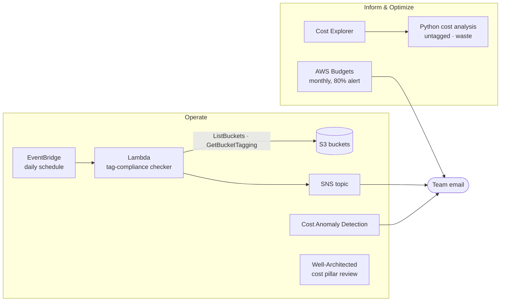

# FinOps · Labs 17–18

← [Back to the README](../../README.md)

```mermaid
flowchart LR
    subgraph Inform & Optimize
        CE[Cost Explorer] --> PY[Python cost analysis<br/>untagged · waste]
        BUD[AWS Budgets<br/>monthly, 80% alert]
    end
    subgraph Operate
        SCH[EventBridge<br/>daily schedule] --> L[Lambda<br/>tag-compliance checker]
        L -->|ListBuckets · GetBucketTagging| S3[(S3 buckets)]
        L --> SNS[SNS topic]
        CAD[Cost Anomaly Detection]
        WA[Well-Architected<br/>cost pillar review]
    end
    BUD --> MAIL([Team email])
    SNS --> MAIL
    CAD --> MAIL
```

Labs: [17](../labs/lab-17.md) · [18](../labs/lab-18.md)
